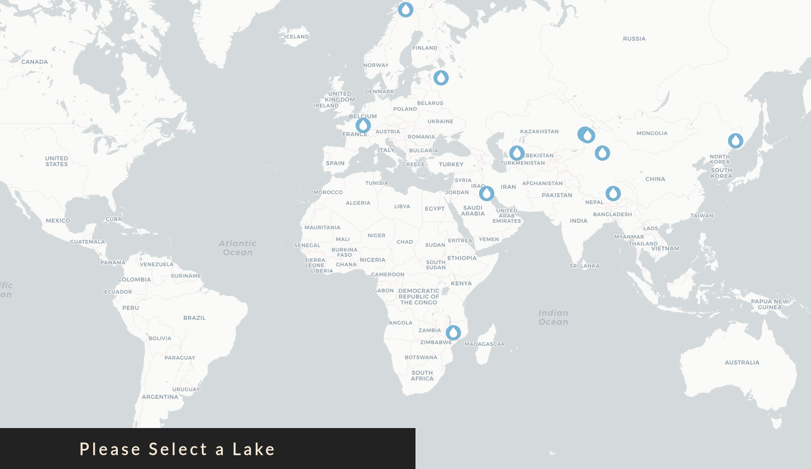

# Requirements
For now, this should work on a Linux environment with Node.js. Some tries happened on Windows but unsuccesful so far.
Hopefully the package.json is full enough, so you shouldn't have to download anything but if you happen to have some troubles with the installation, please let me know with an issue.
## 1. Node.js
Make sure you have Node and npm installed by entering:
```shell
sudo apt-get install nodejs
```

npm should come with it, verify that npm is installed:
```shell
npm -v
```

and update to the latest version:
```shell
npm install npm@latest -g
```

## 2. Redis
Redis is used as cache within the app. More information on [https://redis.io/](https://redis.io/).
This should be straigthforward. First download and make the install:
```shell
wget http://download.redis.io/redis-stable.tar.gz
tar xvzf redis-stable.tar.gz
cd redis-stable
make
```

Sometimes Tcl is missing or not up-to-date:
```shell
sudo apt-get install tcl
```

# Install
1. Go into the cloned folder and type in your terminal:
```shell
npm install
```
This should trigger the installation of the npm repositories mentionned in the package.json file.

2. Then create a ".env" file using the ".env.example" provided. You should just change the username and password.

# Usage
The architecture consist of 3 main things:
1. The database server
2. The node server
3. The app server

The database server is your PostGres server.
You can start both node and app servers by typing in your terminal:
```shell
npm run dev
```

Or you can keep them independant by running separately:
```shell
npm start
```

and 

```shell
npm run serve
```

Hopefully, no errors!
Then you can visit [http://localhost:8080/](http://localhost:8080/).

